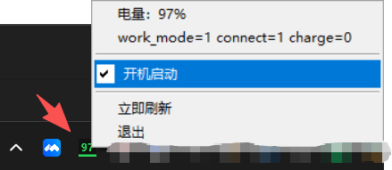

# Keychron Battery Display

这个目录是独立可运行的 Keychron 鼠标电量显示程序。

它不读取 `M3Log_*.log`，也不依赖 BLE GATT。
它直接通过 Keychron 2.4G HID 私有接口读取电量：

- `HidD_SetFeature(0x51 0x06)`
- `DeviceIoControl(IOCTL_HID_GET_FEATURE_REPORT = 0xB0192)`

目录内容：

- `keychron_battery_display.c`
  单文件源码
- `Makefile`
  构建入口
- `config.xml`
  从原项目复制过来的设备识别配置
- `keychron_battery_display.exe`
  默认启动后常驻右下角；加 `--probe` 后输出当前电量

## 构建

```powershell
cd keychron_battery_display
make
```

## 运行

启动任务栏版：

```powershell
.\keychron_battery_display.exe
```

启动后右键任务栏图标，可以选择：

- `开机启动`
  前面有勾表示已启用；无勾且灰色文字表示未启用

启动控制台探针模式：

```powershell
.\keychron_battery_display.exe --probe
```

## 可选参数

- `--interval 10`
  每 10 秒刷新一次
- `--config .\config.xml`
  指定配置文件路径
- `--probe`
  进入控制台输出模式
- `--autostart-on`
  开启当前用户开机启动
- `--autostart-off`
  关闭当前用户开机启动


